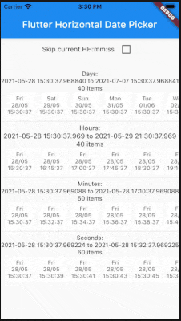

# Flutter Horizontal Date Picker

A Flutter package to create a Horizontal Date Picker. It will be useful for your awesome app.



### Example

It supports you can create a DatePicker with flexible count of items from [begin] to [end] by [itemCount].
By [itemCount] its can split into days, hours, minutes, seconds, that makes you can use this widget in many situations.

```dart
import 'package:flutter_horizontal_date_picker/flutter_horizontal_date_picker.dart';

class _MyHomePageState extends State<MyHomePage> {
  @override
  Widget build(BuildContext context) {
    return Material(
	    child: Column(
	      children: [
	        HorizontalDatePicker(
                begin: DateTime.now(),
                end: DateTime.now().add(Duration(days: 40)),
                selected: DateTime.now(),
                onSelected: (item) {
                  //TODO something
                },
                itemBuilder: (DateTime itemValue, DateTime? selected) {
                  var isSelected =
                      selected?.difference(itemValue).inMilliseconds == 0;
                  return Text(
                    itemValue.formatted(pattern: "EEE\ndd/MM\nHH:mm:ss"),
                    style: TextStyle(
                      color: isSelected ? Colors.white : Colors.black54,
                      fontSize: 12,
                    ),
                    textAlign: TextAlign.center,
                  );
                },
                itemCount: 40,
                itemSpacing: 12,
            ),
	      ],
	    ),
    );
  }
}
```

### Development environment

```
[✓] Flutter (Channel stable, 3.0.1, on macOS 12.3.1 21E258 darwin-x64, locale en-VN)
    • Flutter version 3.0.1 at ~/fvm/versions/stable
    • Upstream repository https://github.com/flutter/flutter.git
    • Framework revision fb57da5f94 (5 days ago), 2022-05-19 15:50:29 -0700
    • Engine revision caaafc5604
    • Dart version 2.17.1
    • DevTools version 2.12.2

[✓] Android toolchain - develop for Android devices (Android SDK version 30.0.3)
    • Android SDK at ~/Library/Android/sdk
    • Platform android-31, build-tools 30.0.3
    • ANDROID_HOME = ~/Library/Android/sdk
    • ANDROID_SDK_ROOT = ~/Library/Android/sdk
    • Java binary at: /Applications/Android Studio.app/Contents/jre/Contents/Home/bin/java
    • Java version OpenJDK Runtime Environment (build 11.0.12+0-b1504.28-7817840)
    • All Android licenses accepted.

[✓] Xcode - develop for iOS and macOS (Xcode 13.3.1)
    • Xcode at /Applications/Xcode.app/Contents/Developer
    • CocoaPods version 1.11.3

[✓] Chrome - develop for the web
    • Chrome at /Applications/Google Chrome.app/Contents/MacOS/Google Chrome

[✓] Android Studio (version 2021.2)
    • Android Studio at /Applications/Android Studio.app/Contents
    • Flutter plugin can be installed from:
      🔨 https://plugins.jetbrains.com/plugin/9212-flutter
    • Dart plugin can be installed from:
      🔨 https://plugins.jetbrains.com/plugin/6351-dart
    • Java version OpenJDK Runtime Environment (build 11.0.12+0-b1504.28-7817840)

[✓] VS Code (version 1.67.2)
    • VS Code at /Applications/Visual Studio Code.app/Contents
    • Flutter extension version 3.40.0
```
